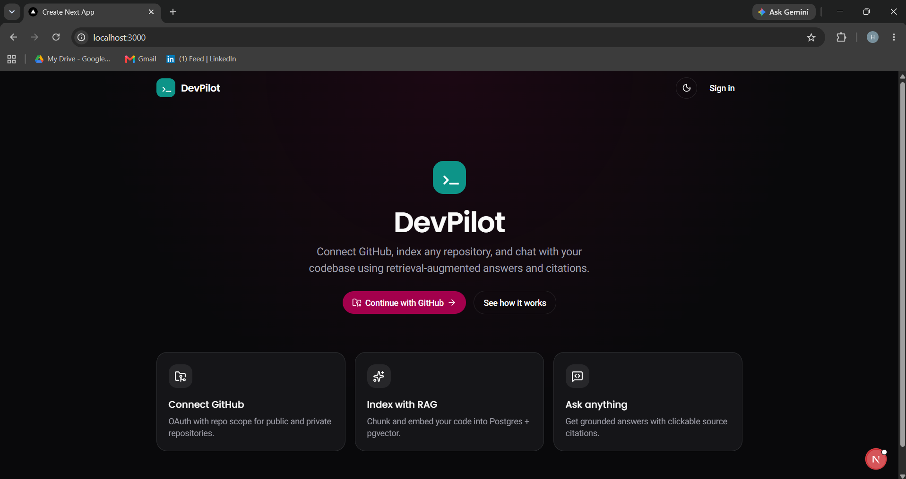
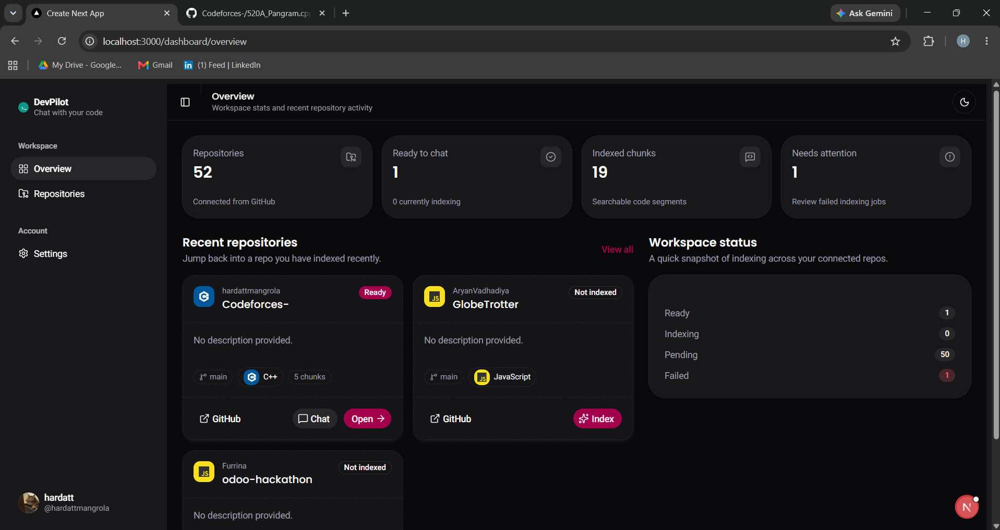
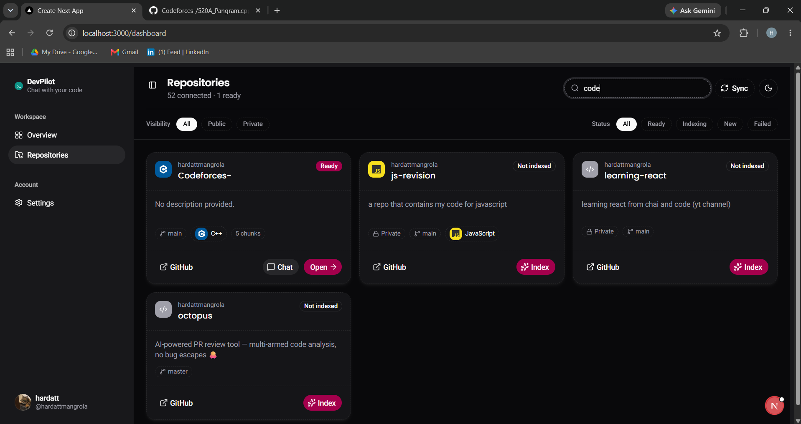
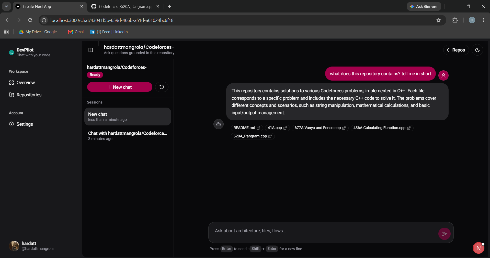
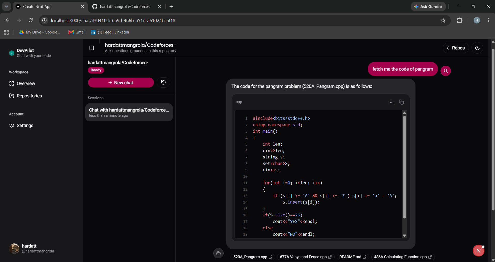
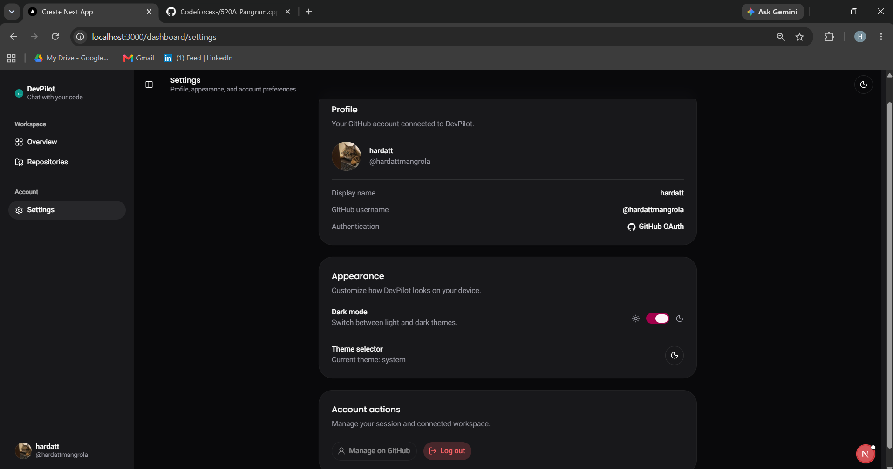
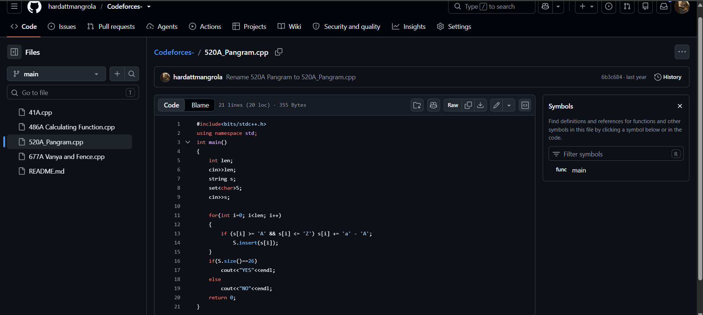

# DevPilot

DevPilot is a developer-focused codebase assistant that connects to GitHub, indexes repository source code, and lets users ask questions grounded in that code. It combines retrieval-augmented generation (RAG) with source citations so answers can be traced back to the relevant files and lines.

The project is organized as a Next.js client and a Spring Boot API. PostgreSQL with the pgvector extension stores application data and vector embeddings, while GitHub OAuth provides repository-aware authentication.

## Table of Contents

- [What It Does](#what-it-does)
- [Tech Stack](#tech-stack)
- [Screenshots](#screenshots)
- [Project Structure](#project-structure)
- [Prerequisites](#prerequisites)
- [Configuration](#configuration)
- [Local Setup](#local-setup)
- [Useful Commands](#useful-commands)
- [Development Notes](#development-notes)
- [Troubleshooting](#troubleshooting)

## What It Does

- Authenticate users with GitHub OAuth.
- List the repositories available to the authenticated GitHub user.
- Index repository files into searchable code chunks.
- Generate embeddings for indexed code and store them in PostgreSQL with pgvector.
- Retrieve relevant code context for a question.
- Stream AI-generated answers in the chat interface.
- Display citations for the files and line ranges used in an answer.

## Tech Stack

### Core Frameworks and Languages

[](https://nextjs.org/)
[](https://react.dev/)
[](https://www.typescriptlang.org/)
[](https://www.oracle.com/java/)
[](https://spring.io/projects/spring-boot)

### Database and Storage

[](https://www.postgresql.org/)
[](https://github.com/pgvector/pgvector)
[](https://hibernate.org/)

### Artificial Intelligence and RAG

[](https://spring.io/projects/spring-ai)
[](https://openai.com/)
[](https://github.com/)

### UI, Styling, and Tooling

[](https://tailwindcss.com/)
[](https://ui.shadcn.com/)
[](https://tanstack.com/query)
[](https://www.docker.com/)
[](https://maven.apache.org/)

The frontend uses Next.js App Router, React, TypeScript, Tailwind CSS, TanStack React Query, Lucide React, React Icons, and Streamdown. The backend uses Spring MVC, Spring Security OAuth 2.0, Spring Data JPA, Spring AI, and Lombok.

## Screenshots

### Landing Page



### Repository Overview



### Repository Details



### Code Chat



### RAG Response with Citations



### Settings



### Indexed Repository



## Project Structure

```text
.
├── backend/                 Spring Boot API and indexing/RAG services
├── client/                  Next.js web application
├── docker/
│   └── postgres/            PostgreSQL initialization scripts
└── docker-compose.yml       Local PostgreSQL + pgvector service
```

## Prerequisites

Install the following before starting development:

- Git
- Java Development Kit (JDK) `21`
- Node.js with npm
- Docker Desktop with Docker Compose
- A GitHub OAuth application
- An OpenAI API key with access to the configured chat and embedding models

## Configuration

The backend reads configuration from environment variables and uses local development defaults for the database and frontend URLs. Create your own environment configuration before running the application.

### Backend variables

| Variable | Purpose | Local example |
| --- | --- | --- |
| `DB_URL` | PostgreSQL JDBC connection string | `jdbc:postgresql://localhost:5433/devpilot` |
| `DB_USERNAME` | PostgreSQL username | `postgres` |
| `DB_PASSWORD` | PostgreSQL password | `postgres` |
| `OPENAI_API_KEY` | OpenAI API key for chat and embeddings | Set privately |
| `GITHUB_CLIENT_ID` | GitHub OAuth client ID | Set privately |
| `GITHUB_CLIENT_SECRET` | GitHub OAuth client secret | Set privately |
| `FRONTEND_URL` | Frontend origin used by the backend | `http://localhost:3000` |
| `CORS_ALLOWED_ORIGINS` | Allowed browser origins | `http://localhost:3000` |
| `TOKEN_ENCRYPTOR_PASSWORD` | Password used to encrypt stored GitHub tokens | Use a strong local value |
| `TOKEN_ENCRYPTOR_SALT` | Salt used by the token encryptor | Use a unique local value |

The GitHub OAuth callback should be configured as:

```text
http://localhost:8080/login/oauth2/code/github
```

### Frontend variables

Create `client/.env.local` when the backend is not running at its default address:

```env
NEXT_PUBLIC_API_BASE_URL=http://localhost:8080
```

Do not commit API keys, OAuth secrets, or production encryption values. Keep secrets in local environment files or a managed secret store.

## Local Setup

### 1. Start PostgreSQL and pgvector

From the repository root:

```bash
docker compose up -d postgres
```

The database is available at `localhost:5433` with these local defaults:

- Database: `devpilot`
- Username: `postgres`
- Password: `postgres`

The Compose service also runs the initialization script that enables the required PostgreSQL extensions.

### 2. Configure the backend

Set the backend variables in your shell or IDE run configuration. For PowerShell, for example:

```powershell
$env:OPENAI_API_KEY = "your-openai-api-key"
$env:GITHUB_CLIENT_ID = "your-github-client-id"
$env:GITHUB_CLIENT_SECRET = "your-github-client-secret"
$env:TOKEN_ENCRYPTOR_PASSWORD = "a-local-development-password"
$env:TOKEN_ENCRYPTOR_SALT = "a-local-development-salt"
```

Start the backend from `backend/`:

```powershell
cd backend
./mvnw.cmd spring-boot:run
```

On macOS or Linux, use `./mvnw spring-boot:run` instead.

The API is available at `http://localhost:8080`.

### 3. Install and start the frontend

In a second terminal:

```bash
cd client
npm install
npm run dev
```

Open [http://localhost:3000](http://localhost:3000) in a browser and choose **Continue with GitHub** to begin.

## Useful Commands

### Frontend

```bash
cd client
npm run dev       # Start the development server
npm run lint      # Run ESLint
npm run build     # Create a production build
npm run start     # Serve the production build
```

### Backend

```powershell
cd backend
./mvnw.cmd test
./mvnw.cmd clean package
./mvnw.cmd spring-boot:run
```

### Database

```bash
docker compose ps

docker compose logs -f postgres
docker compose down
```

Use `docker compose down -v` only when you intentionally want to remove the local PostgreSQL data volume.

## Development Notes

- The backend creates or updates the application schema through Hibernate in the current development configuration.
- Vector embeddings use 1536 dimensions, matching the configured `text-embedding-3-small` model.
- Chat replies are streamed from the backend to the client using server-sent events.
- GitHub repository access is scoped through OAuth permissions, so the OAuth application must be configured with the repository scope required by the application.
- For production deployments, replace local defaults, use managed secrets, configure HTTPS callback URLs, and review CORS and session-cookie settings.

## Troubleshooting

### The frontend cannot reach the API

Confirm that the backend is running on port `8080` or set `NEXT_PUBLIC_API_BASE_URL` in `client/.env.local` to the correct API URL.

### Database connection fails

Check that Docker is running and that PostgreSQL is healthy:

```bash
docker compose ps
docker compose logs postgres
```

Also confirm that the backend is using port `5433`, which is the host port mapped by `docker-compose.yml`.

### GitHub login fails

Verify the GitHub OAuth client ID and secret, and make sure the callback URL exactly matches:

```text
http://localhost:8080/login/oauth2/code/github
```

### Indexing or chat fails

Check that `OPENAI_API_KEY` is available to the backend and that PostgreSQL was started with the pgvector extension enabled.
